# IHUTE Data Model ERD

Entity-Relationship Diagram for the Nashville Transportation Incentive Simulation data warehouse.

## Full Data Model

```mermaid
erDiagram
    %% ==========================================
    %% STAGING LAYER - Hytch Rideshare
    %% ==========================================

    stg_hytch__trips ||--o{ stg_hytch__participants : "has participants"
    stg_hytch__trips {
        varchar trip_id PK
        timestamp trip_started_at
        varchar time_period
        decimal origin_latitude
        decimal origin_longitude
        decimal destination_latitude
        decimal destination_longitude
        decimal distance_miles
        decimal duration_minutes
        int participant_count
        boolean is_carpool
        decimal incentive_amount_usd
        boolean origin_on_i24
        boolean destination_on_i24
    }

    stg_hytch__participants {
        varchar participant_id PK
        varchar trip_id FK
        varchar participant_role
        varchar user_id
    }

    %% ==========================================
    %% STAGING LAYER - LADDMS Trajectories
    %% ==========================================

    stg_laddms__zones ||--o{ stg_laddms__trajectories : "contains"
    stg_laddms__trajectories {
        varchar trajectory_id PK
        varchar object_id
        varchar location_id FK
        varchar classification
        bigint timestamp_sec
        decimal x_coord
        decimal y_coord
        decimal latitude
        decimal longitude
        decimal speed_mps
        decimal heading_degrees
    }

    stg_laddms__trajectory_counts {
        varchar count_id PK
        timestamp recorded_at
        varchar location_id
        int vehicle_count
    }

    stg_laddms__zones {
        varchar zone_id PK
        varchar zone_name
        decimal lat_min
        decimal lat_max
        decimal lon_min
        decimal lon_max
        decimal mile_marker_start
        decimal mile_marker_end
    }

    stg_laddms__pet {
        varchar pet_id PK
        varchar object_id_1
        varchar object_id_2
        timestamp recorded_at
        decimal pet_seconds
        varchar pet_severity
    }

    %% ==========================================
    %% STAGING LAYER - Simulation
    %% ==========================================

    stg_sim__runs ||--o{ stg_sim__agent_decisions : "contains"
    stg_sim__runs ||--o{ stg_sim__incentive_events : "contains"
    stg_sim__runs ||--o{ stg_sim__metrics_timeseries : "records"

    stg_sim__runs {
        varchar simulation_run_id PK
        varchar scenario_name
        timestamp started_at
        timestamp completed_at
        varchar run_status
        json config_json
        boolean is_baseline
        varchar scenario_type
    }

    stg_sim__agent_decisions {
        varchar decision_id PK
        varchar agent_id
        varchar simulation_run_id FK
        varchar decision_type
        varchar chosen_option
        decimal utility_value
        boolean accepted_incentive
    }

    stg_sim__incentive_events {
        varchar event_id PK
        varchar agent_id
        varchar simulation_run_id FK
        varchar allocation_id
        varchar incentive_type
        varchar event_type
        decimal amount_usd
        boolean is_successful
    }

    stg_sim__metrics_timeseries {
        varchar metric_id PK
        varchar simulation_run_id FK
        timestamp recorded_at
        varchar metric_name
        decimal metric_value
    }

    %% ==========================================
    %% MARTS LAYER - Dimensions
    %% ==========================================

    dim_time_periods {
        varchar time_period_id PK
        int hour_of_day
        int day_of_week
        varchar day_name
        boolean is_weekday
        varchar time_period
        boolean is_peak
    }

    dim_incentive_types {
        varchar incentive_type_id PK
        varchar incentive_type
        varchar incentive_description
        decimal typical_amount_min
        decimal typical_amount_max
    }

    dim_corridors {
        varchar corridor_id PK
        varchar corridor_name
        decimal mile_marker_start
        decimal mile_marker_end
        decimal corridor_length_miles
    }

    %% ==========================================
    %% MARTS LAYER - Facts
    %% ==========================================

    dim_corridors ||--o{ fct_corridor_flows : "measured at"
    dim_time_periods ||--o{ fct_corridor_flows : "during"

    fct_corridor_flows {
        varchar flow_id PK
        varchar corridor_id FK
        varchar time_period_id FK
        timestamp recorded_at
        int vehicle_count
        decimal avg_speed_mph
        decimal congestion_index
        varchar level_of_service
    }

    dim_time_periods ||--o{ fct_mode_choices : "during"

    fct_mode_choices {
        varchar choice_id PK
        varchar trip_id
        varchar time_period_id FK
        boolean is_carpool
        int participant_count
        decimal incentive_amount_usd
    }

    dim_incentive_types ||--o{ fct_incentive_events : "categorizes"
    stg_sim__runs ||--o{ fct_incentive_events : "from run"

    fct_incentive_events {
        varchar event_id PK
        varchar incentive_type_id FK
        varchar simulation_run_id FK
        varchar agent_id
        varchar event_type
        decimal amount_usd
        boolean is_successful
    }

    fct_simulation_runs {
        varchar run_id PK
        varchar scenario_name
        boolean is_baseline
        decimal total_budget
        decimal total_spent
        decimal avg_speed_improvement
        decimal vmt_reduction_pct
    }

    %% ==========================================
    %% MARTS LAYER - Metrics
    %% ==========================================

    dim_corridors ||--o{ metrics_congestion : "for corridor"

    metrics_congestion {
        varchar metric_id PK
        varchar corridor_id FK
        varchar time_period
        decimal congestion_index
        decimal reliability_index
    }

    metrics_incentive_effectiveness {
        varchar metric_id PK
        varchar incentive_type
        varchar scenario_name
        decimal acceptance_rate
        decimal completion_rate
        decimal roi
    }

    metrics_elasticity {
        varchar metric_id PK
        varchar feature_name
        decimal elasticity_coefficient
        decimal p_value
    }

    metrics_scenario_comparison {
        varchar comparison_id PK
        varchar scenario_name
        decimal speed_improvement_pct
        decimal vmt_change_pct
        decimal cost_effectiveness_rank
    }
```

## Layer Overview

## Data Domain Relationships

## Key Metrics Summary

| Domain | Key Metrics | Source |
|--------|-------------|--------|
| **Traffic** | Congestion Index, Reliability Index, Level of Service | LADDMS trajectories |
| **Safety** | Post-Encroachment Time (PET), Severity Distribution | LADDMS PET metrics |
| **Behavioral** | Mode Choice Elasticity, Incentive Sensitivity | Hytch trip data |
| **Incentives** | Acceptance Rate, Completion Rate, ROI, Cost per VMT | Simulation events |
| **Scenarios** | Speed Improvement %, VMT Reduction %, Occupancy Change | Scenario comparison |
