# Fix dbt Project Implementation Plan

> **For Claude:** REQUIRED SUB-SKILL: Use superpowers:executing-plans to implement this plan task-by-task.

**Goal:** Create seed data, fix all dbt tests, add documentation, ERD diagram, DBML schema, and proper .gitignore.

**Architecture:** The dbt project has 26 models but no source data. We'll create seed CSV files that dbt can load into the raw schema, fix the source references, generate documentation, and create schema diagrams.

**Tech Stack:** dbt Core, DuckDB, dbt-utils, dbt_expectations

---

## Task 1: Add dbt .gitignore

**Files:**
- Create: `dbt/.gitignore`

**Step 1: Create the .gitignore file**

```gitignore
# dbt artifacts
target/
dbt_packages/
dbt_modules/
logs/

# Lock files
package-lock.yml

# User config
.user.yml

# Don't commit local profiles
profiles.yml

# Documentation build
docs/
!docs/plans/

# DuckDB files
*.duckdb
*.wal
```

**Step 2: Verify file created**

Run: `cat dbt/.gitignore`
Expected: File contents displayed

**Step 3: Commit**

```bash
git add dbt/.gitignore
git commit -m "chore: add dbt .gitignore"
```

---

## Task 2: Create Hytch Trips Seed Data

**Files:**
- Create: `dbt/seeds/raw_hytch_trips.csv`
- Modify: `dbt/dbt_project.yml` (add seeds config)

**Step 1: Create seed CSV with sample trip data**

Create `dbt/seeds/raw_hytch_trips.csv`:

```csv
trip_id,timestamp,origin_lat,origin_lng,dest_lat,dest_lng,distance_miles,duration_minutes,n_participants,incentive_amount,is_carpool
T001,2024-03-15 07:30:00,36.12,-86.80,36.18,-86.65,12.5,25,2,5.00,true
T002,2024-03-15 07:45:00,36.10,-86.75,36.15,-86.70,8.2,18,1,0.00,false
T003,2024-03-15 08:00:00,36.15,-86.78,36.20,-86.68,15.3,32,3,7.50,true
T004,2024-03-15 08:15:00,36.08,-86.82,36.16,-86.72,10.1,22,2,4.00,true
T005,2024-03-15 17:30:00,36.18,-86.65,36.12,-86.80,12.5,28,2,5.00,true
T006,2024-03-15 17:45:00,36.15,-86.70,36.10,-86.75,8.2,20,1,0.00,false
T007,2024-03-15 18:00:00,36.20,-86.68,36.15,-86.78,15.3,35,4,10.00,true
T008,2024-03-16 07:30:00,36.11,-86.79,36.17,-86.66,11.8,24,2,4.50,true
T009,2024-03-16 08:00:00,36.14,-86.77,36.19,-86.69,13.2,28,3,6.00,true
T010,2024-03-16 17:30:00,36.17,-86.66,36.11,-86.79,11.8,26,2,4.50,true
```

**Step 2: Run seed to verify**

Run: `dbt seed --select raw_hytch_trips`
Expected: Seed loads successfully

---

## Task 3: Create Hytch Participants Seed Data

**Files:**
- Create: `dbt/seeds/raw_hytch_participants.csv`

**Step 1: Create seed CSV**

Create `dbt/seeds/raw_hytch_participants.csv`:

```csv
participant_id,trip_id,role,user_id
P001,T001,DRIVER,U001
P002,T001,PASSENGER,U002
P003,T002,DRIVER,U003
P004,T003,DRIVER,U004
P005,T003,PASSENGER,U005
P006,T003,PASSENGER,U006
P007,T004,DRIVER,U007
P008,T004,PASSENGER,U008
P009,T005,DRIVER,U001
P010,T005,PASSENGER,U002
P011,T006,DRIVER,U003
P012,T007,DRIVER,U004
P013,T007,PASSENGER,U005
P014,T007,PASSENGER,U006
P015,T007,PASSENGER,U009
P016,T008,DRIVER,U010
P017,T008,PASSENGER,U011
P018,T009,DRIVER,U012
P019,T009,PASSENGER,U013
P020,T009,PASSENGER,U014
P021,T010,DRIVER,U010
P022,T010,PASSENGER,U011
```

**Step 2: Run seed**

Run: `dbt seed --select raw_hytch_participants`
Expected: Seed loads successfully

---

## Task 4: Create LADDMS Trajectories Seed Data

**Files:**
- Create: `dbt/seeds/raw_laddms_trajectories.csv`

**Step 1: Create seed CSV with array data**

Create `dbt/seeds/raw_laddms_trajectories.csv`:

```csv
object_id,location_id,classification,sub_classification,obj_length,obj_width,obj_height,avg_filtered_confidence,ts,x,y
V001,LOC01,VEHICLE,sedan,4.5,1.8,1.4,0.95,"[1710500000,1710500001,1710500002]","[100.0,110.0,120.0]","[50.0,52.0,54.0]"
V002,LOC01,VEHICLE,suv,4.8,2.0,1.7,0.92,"[1710500000,1710500001,1710500002]","[200.0,212.0,224.0]","[60.0,62.5,65.0]"
V003,LOC01,TRUCK,pickup,5.5,2.1,1.9,0.88,"[1710500000,1710500001,1710500002]","[300.0,315.0,330.0]","[70.0,73.0,76.0]"
V004,LOC02,VEHICLE,sedan,4.4,1.8,1.4,0.94,"[1710500100,1710500101,1710500102]","[150.0,162.0,174.0]","[80.0,82.0,84.0]"
V005,LOC02,VEHICLE,sedan,4.6,1.9,1.5,0.91,"[1710500100,1710500101,1710500102]","[250.0,265.0,280.0]","[90.0,93.0,96.0]"
```

**Note:** DuckDB may need special handling for array columns. If seeds don't work with arrays, we'll create a SQL-based source instead.

---

## Task 5: Create LADDMS Counts Seed Data

**Files:**
- Create: `dbt/seeds/raw_laddms_trajectory_counts.csv`

**Step 1: Create seed CSV**

```csv
count_id,timestamp,location_id,vehicle_count
C001,2024-03-15 07:00:00,LOC01,450
C002,2024-03-15 07:00:00,LOC02,380
C003,2024-03-15 08:00:00,LOC01,620
C004,2024-03-15 08:00:00,LOC02,540
C005,2024-03-15 17:00:00,LOC01,680
C006,2024-03-15 17:00:00,LOC02,590
C007,2024-03-15 18:00:00,LOC01,720
C008,2024-03-15 18:00:00,LOC02,650
```

---

## Task 6: Create LADDMS Zones Seed Data

**Files:**
- Create: `dbt/seeds/raw_laddms_zones.csv`

**Step 1: Create seed CSV**

```csv
zone_id,zone_name,lat_min,lat_max,lon_min,lon_max,mile_marker_start,mile_marker_end
Z001,Antioch,36.05,36.10,-86.70,-86.65,52.0,55.0
Z002,La Vergne,36.10,36.14,-86.80,-86.70,48.0,52.0
Z003,Smyrna,36.14,36.18,-86.85,-86.80,44.0,48.0
Z004,Murfreesboro,36.18,36.22,-86.90,-86.85,40.0,44.0
```

---

## Task 7: Create LADDMS PET Seed Data

**Files:**
- Create: `dbt/seeds/raw_laddms_pet.csv`

**Step 1: Create seed CSV**

```csv
pet_id,object_id_1,object_id_2,pet_seconds,timestamp
PET001,V001,V002,2.5,2024-03-15 07:30:15
PET002,V003,V004,1.8,2024-03-15 07:45:22
PET003,V001,V003,3.2,2024-03-15 08:00:10
PET004,V002,V005,2.1,2024-03-15 17:30:05
PET005,V004,V005,1.5,2024-03-15 17:45:18
```

---

## Task 8: Create Simulation Runs Seed Data

**Files:**
- Create: `dbt/seeds/raw_simulation_runs.csv`

**Step 1: Create seed CSV**

```csv
simulation_run_id,scenario_name,started_at,completed_at,config
RUN001,baseline,2024-03-15 06:00:00,2024-03-15 06:45:00,"{""budget"": 0, ""incentive_enabled"": false}"
RUN002,carpool_incentive,2024-03-15 07:00:00,2024-03-15 07:48:00,"{""budget"": 10000, ""incentive_type"": ""CARPOOL""}"
RUN003,pacer_program,2024-03-15 08:00:00,2024-03-15 08:52:00,"{""budget"": 15000, ""incentive_type"": ""PACER""}"
RUN004,transit_promo,2024-03-15 09:00:00,2024-03-15 09:40:00,"{""budget"": 8000, ""incentive_type"": ""TRANSIT""}"
RUN005,combined,2024-03-15 10:00:00,2024-03-15 10:55:00,"{""budget"": 25000, ""incentive_types"": [""CARPOOL"",""PACER""]}"
```

---

## Task 9: Create Agent Decisions Seed Data

**Files:**
- Create: `dbt/seeds/raw_agent_decisions.csv`

**Step 1: Create seed CSV**

```csv
decision_id,agent_id,simulation_run_id,timestamp,decision_type,chosen_option,utility
D001,A001,RUN002,2024-03-15 07:00:00,MODE_CHOICE,carpool,0.82
D002,A002,RUN002,2024-03-15 07:05:00,MODE_CHOICE,drive_alone,0.65
D003,A003,RUN002,2024-03-15 07:10:00,MODE_CHOICE,carpool,0.78
D004,A001,RUN002,2024-03-15 07:00:00,ROUTE_CHOICE,i24_main,0.71
D005,A002,RUN002,2024-03-15 07:05:00,ROUTE_CHOICE,local_roads,0.58
D006,A004,RUN003,2024-03-15 08:00:00,DEPARTURE_TIME,shift_early,0.88
D007,A005,RUN003,2024-03-15 08:05:00,DEPARTURE_TIME,no_shift,0.45
D008,A006,RUN003,2024-03-15 08:10:00,INCENTIVE_RESPONSE,accept,0.92
D009,A007,RUN004,2024-03-15 09:00:00,MODE_CHOICE,transit,0.75
D010,A008,RUN004,2024-03-15 09:05:00,MODE_CHOICE,drive_alone,0.62
```

---

## Task 10: Create Incentive Events Seed Data

**Files:**
- Create: `dbt/seeds/raw_incentive_events.csv`

**Step 1: Create seed CSV**

```csv
event_id,agent_id,simulation_run_id,allocation_id,incentive_type,event_type,amount,timestamp,conditions,performance_metrics
E001,A001,RUN002,ALLOC001,CARPOOL,OFFER,5.00,2024-03-15 07:00:00,,
E002,A001,RUN002,ALLOC001,CARPOOL,ACCEPT,5.00,2024-03-15 07:01:00,,
E003,A001,RUN002,ALLOC001,CARPOOL,COMPLETE,5.00,2024-03-15 07:45:00,,"{""distance"": 12.5, ""passengers"": 2}"
E004,A003,RUN002,ALLOC002,CARPOOL,OFFER,5.00,2024-03-15 07:10:00,,
E005,A003,RUN002,ALLOC002,CARPOOL,ACCEPT,5.00,2024-03-15 07:11:00,,
E006,A003,RUN002,ALLOC002,CARPOOL,COMPLETE,5.00,2024-03-15 07:50:00,,"{""distance"": 10.2, ""passengers"": 1}"
E007,A006,RUN003,ALLOC003,PACER,OFFER,8.00,2024-03-15 08:10:00,"{""target_speed"": 55}",
E008,A006,RUN003,ALLOC003,PACER,ACCEPT,8.00,2024-03-15 08:11:00,,
E009,A006,RUN003,ALLOC003,PACER,COMPLETE,8.00,2024-03-15 08:45:00,,"{""avg_speed"": 54.2, ""compliance"": 0.95}"
E010,A007,RUN004,ALLOC004,TRANSIT,OFFER,3.00,2024-03-15 09:00:00,,
E011,A007,RUN004,ALLOC004,TRANSIT,ACCEPT,3.00,2024-03-15 09:01:00,,
E012,A007,RUN004,ALLOC004,TRANSIT,COMPLETE,3.00,2024-03-15 09:40:00,,
E013,A009,RUN002,ALLOC005,CARPOOL,OFFER,5.00,2024-03-15 07:30:00,,
E014,A009,RUN002,ALLOC005,CARPOOL,REJECT,0.00,2024-03-15 07:31:00,,
E015,A010,RUN003,ALLOC006,DEPARTURE_SHIFT,OFFER,4.00,2024-03-15 08:30:00,,
E016,A010,RUN003,ALLOC006,DEPARTURE_SHIFT,EXPIRE,0.00,2024-03-15 09:00:00,,
```

---

## Task 11: Create Metrics Timeseries Seed Data

**Files:**
- Create: `dbt/seeds/raw_metrics_timeseries.csv`

**Step 1: Create seed CSV**

```csv
metric_id,simulation_run_id,timestamp,metric_name,metric_value
M001,RUN001,2024-03-15 07:00:00,avg_speed_mph,45.2
M002,RUN001,2024-03-15 07:30:00,avg_speed_mph,38.5
M003,RUN001,2024-03-15 08:00:00,avg_speed_mph,32.1
M004,RUN002,2024-03-15 07:00:00,avg_speed_mph,46.8
M005,RUN002,2024-03-15 07:30:00,avg_speed_mph,42.3
M006,RUN002,2024-03-15 08:00:00,avg_speed_mph,38.9
M007,RUN001,2024-03-15 07:00:00,vehicle_count,1200
M008,RUN001,2024-03-15 08:00:00,vehicle_count,1850
M009,RUN002,2024-03-15 07:00:00,vehicle_count,1180
M010,RUN002,2024-03-15 08:00:00,vehicle_count,1720
M011,RUN001,2024-03-15 07:00:00,vmt,15000
M012,RUN002,2024-03-15 07:00:00,vmt,14200
M013,RUN003,2024-03-15 08:00:00,avg_speed_mph,41.5
M014,RUN003,2024-03-15 08:00:00,vehicle_count,1650
M015,RUN004,2024-03-15 09:00:00,transit_ridership,320
```

---

## Task 12: Update Source Definitions to Use Seeds

**Files:**
- Modify: `dbt/models/staging/hytch/_hytch__sources.yml`
- Modify: `dbt/models/staging/laddms/_laddms__sources.yml`
- Modify: `dbt/models/staging/simulation/_simulation__sources.yml`

**Step 1: Update Hytch source to use seeds schema**

Change `schema: raw` to reference the seeds. In dbt, seeds load to the target schema by default. Update the source database reference:

```yaml
sources:
  - name: hytch
    description: "Hytch rideshare trip data for behavioral model calibration"
    schema: main  # Seeds load to default schema
    tables:
      - name: trips
        identifier: raw_hytch_trips  # Match seed file name
        # ... rest unchanged
      - name: participants
        identifier: raw_hytch_participants
        # ... rest unchanged
```

Do similar for laddms and simulation sources.

---

## Task 13: Update Staging Models for Seed Column Names

**Files:**
- Potentially modify staging SQL files if column names differ

**Step 1: Verify column mappings match between seeds and staging models**

Compare seed CSV headers with `source()` field references in staging SQL. Adjust as needed.

---

## Task 14: Run dbt build to Verify All Models

**Step 1: Install dependencies**

Run: `dbt deps`

**Step 2: Load seeds**

Run: `dbt seed`
Expected: All seeds load successfully

**Step 3: Build all models**

Run: `dbt build`
Expected: All models build successfully, all tests pass

---

## Task 15: Create DBML Schema File

**Files:**
- Create: `dbt/docs/schema.dbml`

**Step 1: Create DBML file documenting the schema**

```dbml
// IHUTE Nashville Transportation Simulation
// Database Schema (DBML)

Project ihute {
  database_type: 'DuckDB'
  Note: 'Agent-based simulation for I-24 corridor incentive mechanisms'
}

// ==========================================
// STAGING LAYER
// ==========================================

Table stg_hytch__trips {
  trip_id varchar [pk]
  trip_started_at timestamp
  trip_date date
  hour_of_day int
  day_of_week int
  time_period varchar [note: 'AM_PEAK, PM_PEAK, OFF_PEAK']
  is_weekday boolean
  origin_latitude decimal
  origin_longitude decimal
  destination_latitude decimal
  destination_longitude decimal
  distance_miles decimal
  duration_minutes decimal
  avg_speed_mph decimal
  participant_count int
  is_carpool boolean
  incentive_amount_usd decimal
  origin_on_i24 boolean
  destination_on_i24 boolean
}

Table stg_hytch__participants {
  participant_id varchar [pk]
  trip_id varchar [ref: > stg_hytch__trips.trip_id]
  participant_role varchar [note: 'DRIVER, PASSENGER']
  user_id varchar
}

Table stg_laddms__trajectories {
  trajectory_id varchar [pk]
  object_id varchar
  location_id varchar
  classification varchar
  timestamp_sec bigint
  x_coord decimal
  y_coord decimal
  latitude decimal
  longitude decimal
  speed_mps decimal
  speed_mph decimal
  heading_degrees decimal
}

Table stg_sim__runs {
  simulation_run_id varchar [pk]
  scenario_name varchar
  started_at timestamp
  completed_at timestamp
  config json
}

Table stg_sim__agent_decisions {
  decision_id varchar [pk]
  agent_id varchar
  simulation_run_id varchar [ref: > stg_sim__runs.simulation_run_id]
  decision_type varchar [note: 'MODE_CHOICE, ROUTE_CHOICE, DEPARTURE_TIME, INCENTIVE_RESPONSE']
  chosen_option varchar
  utility decimal
}

Table stg_sim__incentive_events {
  event_id varchar [pk]
  agent_id varchar
  simulation_run_id varchar [ref: > stg_sim__runs.simulation_run_id]
  incentive_type varchar [note: 'CARPOOL, PACER, DEPARTURE_SHIFT, TRANSIT']
  event_type varchar [note: 'OFFER, ACCEPT, REJECT, COMPLETE, EXPIRE, CANCEL']
  amount_usd decimal
  event_at timestamp
}

// ==========================================
// MARTS LAYER - DIMENSIONS
// ==========================================

Table dim_time_periods {
  time_period_id varchar [pk]
  hour_of_day int
  day_of_week int
  day_name varchar
  is_weekday boolean
  time_period varchar
  is_peak boolean
}

Table dim_incentive_types {
  incentive_type_id varchar [pk]
  incentive_type varchar
  description varchar
  typical_amount_usd decimal
}

Table dim_corridors {
  corridor_id varchar [pk]
  corridor_name varchar
  mile_marker_start decimal
  mile_marker_end decimal
  lat_min decimal
  lat_max decimal
  lon_min decimal
  lon_max decimal
}

// ==========================================
// MARTS LAYER - FACTS
// ==========================================

Table fct_corridor_flows {
  flow_id varchar [pk]
  corridor_id varchar [ref: > dim_corridors.corridor_id]
  time_period_id varchar [ref: > dim_time_periods.time_period_id]
  recorded_at timestamp
  vehicle_count int
  avg_speed_mph decimal
  congestion_index decimal
  level_of_service varchar
}

Table fct_mode_choices {
  choice_id varchar [pk]
  trip_id varchar
  time_period_id varchar [ref: > dim_time_periods.time_period_id]
  is_carpool boolean
  participant_count int
  incentive_amount_usd decimal
}

Table fct_incentive_events {
  event_id varchar [pk]
  incentive_type_id varchar [ref: > dim_incentive_types.incentive_type_id]
  simulation_run_id varchar [ref: > stg_sim__runs.simulation_run_id]
  agent_id varchar
  event_type varchar
  amount_usd decimal
  event_at timestamp
}

Table fct_simulation_runs {
  run_id varchar [pk]
  scenario_name varchar
  is_baseline boolean
  total_budget decimal
  total_spent decimal
  avg_speed_improvement decimal
  vmt_reduction_pct decimal
}

// ==========================================
// MARTS LAYER - METRICS
// ==========================================

Table metrics_congestion {
  metric_id varchar [pk]
  corridor_id varchar [ref: > dim_corridors.corridor_id]
  time_period varchar
  congestion_index decimal
  reliability_index decimal
  buffer_time_index decimal
}

Table metrics_incentive_effectiveness {
  metric_id varchar [pk]
  incentive_type varchar
  scenario_name varchar
  acceptance_rate decimal
  completion_rate decimal
  cost_per_trip_reduced decimal
  roi decimal
}

Table metrics_elasticity {
  metric_id varchar [pk]
  feature_name varchar
  elasticity_coefficient decimal
  p_value decimal
  sample_size int
}

Table metrics_scenario_comparison {
  comparison_id varchar [pk]
  scenario_name varchar
  baseline_scenario varchar
  speed_improvement_pct decimal
  vmt_change_pct decimal
  occupancy_change_pct decimal
  cost_effectiveness decimal
}
```

---

## Task 16: Create ERD Diagram (Mermaid)

**Files:**
- Create: `dbt/docs/erd.md`

**Step 1: Create ERD in Mermaid format**

```markdown
# IHUTE Data Model ERD

```mermaid
erDiagram
    %% Staging - Hytch
    stg_hytch__trips ||--o{ stg_hytch__participants : "has"
    stg_hytch__trips {
        varchar trip_id PK
        timestamp trip_started_at
        decimal origin_latitude
        decimal origin_longitude
        decimal distance_miles
        boolean is_carpool
        decimal incentive_amount_usd
    }
    stg_hytch__participants {
        varchar participant_id PK
        varchar trip_id FK
        varchar participant_role
    }

    %% Staging - Simulation
    stg_sim__runs ||--o{ stg_sim__agent_decisions : "contains"
    stg_sim__runs ||--o{ stg_sim__incentive_events : "contains"
    stg_sim__runs ||--o{ stg_sim__metrics_timeseries : "contains"
    stg_sim__runs {
        varchar simulation_run_id PK
        varchar scenario_name
        timestamp started_at
        json config
    }
    stg_sim__agent_decisions {
        varchar decision_id PK
        varchar simulation_run_id FK
        varchar agent_id
        varchar decision_type
        varchar chosen_option
    }
    stg_sim__incentive_events {
        varchar event_id PK
        varchar simulation_run_id FK
        varchar agent_id
        varchar incentive_type
        varchar event_type
        decimal amount_usd
    }
    stg_sim__metrics_timeseries {
        varchar metric_id PK
        varchar simulation_run_id FK
        varchar metric_name
        decimal metric_value
    }

    %% Marts - Dimensions
    dim_time_periods {
        varchar time_period_id PK
        int hour_of_day
        int day_of_week
        boolean is_peak
    }
    dim_incentive_types {
        varchar incentive_type_id PK
        varchar incentive_type
        varchar description
    }
    dim_corridors {
        varchar corridor_id PK
        varchar corridor_name
        decimal mile_marker_start
        decimal mile_marker_end
    }

    %% Marts - Facts
    dim_corridors ||--o{ fct_corridor_flows : "measured at"
    dim_time_periods ||--o{ fct_corridor_flows : "during"
    fct_corridor_flows {
        varchar flow_id PK
        varchar corridor_id FK
        varchar time_period_id FK
        int vehicle_count
        decimal avg_speed_mph
    }

    dim_time_periods ||--o{ fct_mode_choices : "during"
    fct_mode_choices {
        varchar choice_id PK
        varchar time_period_id FK
        boolean is_carpool
        int participant_count
    }

    dim_incentive_types ||--o{ fct_incentive_events : "of type"
    stg_sim__runs ||--o{ fct_incentive_events : "from run"
    fct_incentive_events {
        varchar event_id PK
        varchar incentive_type_id FK
        varchar simulation_run_id FK
        decimal amount_usd
    }

    %% Metrics
    dim_corridors ||--o{ metrics_congestion : "for"
    metrics_congestion {
        varchar metric_id PK
        varchar corridor_id FK
        decimal congestion_index
    }
```


```

---

## Task 17: Generate dbt Documentation

**Step 1: Generate docs**

Run: `dbt docs generate`
Expected: Docs generated in target/

**Step 2: Serve docs locally (optional verification)**

Run: `dbt docs serve --port 8080`
Expected: Opens browser with documentation site

---

## Task 18: Final Verification

**Step 1: Run full build**

Run: `dbt build`
Expected: All 26 models pass, all 77 tests pass

**Step 2: Commit all changes**

```bash
git add dbt/seeds/ dbt/docs/ dbt/models/staging/
git commit -m "feat: add seed data, DBML schema, and ERD diagram"
```

---

## Summary of Deliverables

1. **dbt/.gitignore** - Proper ignore patterns for dbt artifacts
2. **Seeds (10 files)** - Sample data for all source tables
3. **Updated sources** - Point to seed tables
4. **DBML schema** - `dbt/docs/schema.dbml`
5. **ERD diagram** - `dbt/docs/erd.md` (Mermaid format)
6. **Documentation** - Generated via `dbt docs generate`
7. **Passing tests** - All 77 tests should pass
